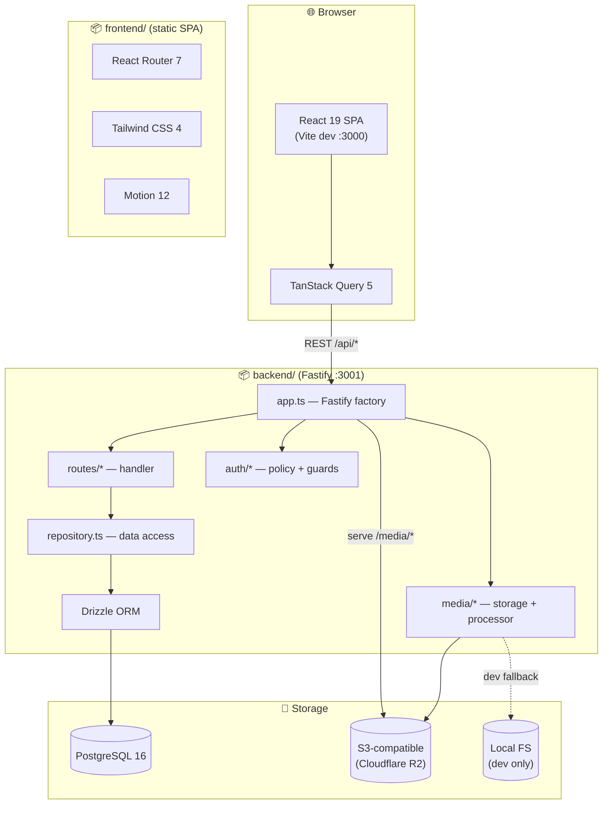
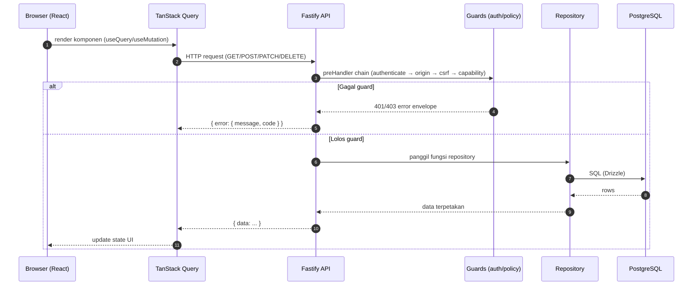
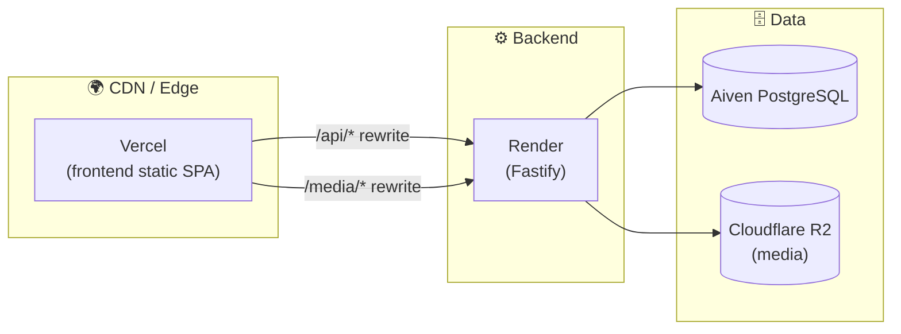

# 02 — Architecture

## 🏗️ Ringkasan

Arsitektur **npm workspaces monorepo** dengan dua workspace (`frontend/`, `backend/`) dan penyimpanan eksternal (PostgreSQL + S3-compatible object storage).

## 🔄 Alur Request Umum

## 🧩 Komponen Kunci Backend

| Modul | File | Tanggung jawab |
|---|---|---|
| Entry point | `backend/src/index.ts` | load env, buat DB/storage/app, listen, graceful shutdown |
| App factory | `backend/src/app.ts` | daftarkan plugin (helmet, cors, cookie, rate-limit, multipart, compress, static), error handler, wire semua route |
| Config | `backend/src/config/env.ts` | parse + validasi environment (Zod), aturan produksi ketat |
| DB client | `backend/src/db/client.ts` | `postgres` + `drizzle` |
| Schema | `backend/src/db/schema.ts` | definisi tabel + enum + constraint (sumber kebenaran) |
| Repository | `backend/src/db/repository.ts` | SEMUA query DB; satu-satunya tempat SQL |
| Policy | `backend/src/auth/policy.ts` | role → capability matrix + helper scope |
| Guards | `backend/src/auth/guards.ts` | `authenticate`, `origin`, `csrf`, `requireCapability` |
| Security | `backend/src/auth/security.ts` | Argon2id hash, token acak, SHA-256 hash, safeEqual |
| Media | `backend/src/media/` | storage (FS/S3) + processor (Sharp WebP) |
| Routes | `backend/src/routes/*.ts` | handler HTTP per family |
| Domain | `backend/src/domain/` | normalisasi phone + koordinat |

## 🧩 Komponen Kunci Frontend

| Modul | File | Tanggung jawab |
|---|---|---|
| Root | `frontend/src/main.tsx` | Router + providers + guard + lazy loading |
| Homepage | `frontend/src/App.tsx` | komposisi section homepage + dialog |
| API client | `frontend/src/lib/api.ts` | fetch wrapper, error envelope, retry, Bearer fallback |
| Management API | `frontend/src/lib/management.ts` | klien endpoint dashboard |
| Auth | `frontend/src/lib/auth.ts` + `hooks/useAuth.ts` | session, CSRF, login/logout |
| Guards | `frontend/src/components/dashboard/Guards.tsx` | `PublicOnlyGuard`, `ProtectedGuard`, `PasswordGuard`, `CapabilityGuard` |
| Hooks | `frontend/src/hooks/` | `useProducts`, `useUMKMs`, `useManagement`, `useDiscoveryUrlState` |
| SEO | `frontend/src/lib/seo.ts` | metadata, canonical, JSON-LD |

## 🔌 Plugin Fastify (urutan register di `app.ts`)

| Plugin | Kegunaan |
|---|---|
| `@fastify/helmet` | Header keamanan + CSP (img `self/data/https`, frame `openstreetmap`) |
| `@fastify/compress` | Gzip/br (threshold 1024) |
| `@fastify/cookie` | Parse/set cookie |
| `@fastify/rate-limit` | Global rate limit (default 100/menit) |
| `@fastify/cors` | CORS credentialed, origin allowlist |
| `@fastify/multipart` | Upload file (max `MEDIA_MAX_BYTES`, 1 file) |
| `@fastify/static` | Serve frontend dist (produksi only, SPA fallback) |

## 🚀 Deployment Topology (produksi)

- **Vercel** (`vercel.json`): rewrite `/api/*` dan `/media/*` ke Render; sisanya SPA fallback ke `index.html`.
- **Render** (`render.yaml`): build backend, `db:migrate` + `start`, health check `/api/health`.
- **Aiven**: PostgreSQL terkelola dengan `sslmode=require`.
- **R2**: S3-compatible object storage untuk media.

> Detail lengkap: [10 — Deployment](10-deployment.md).

## ⚙️ Lingkungan (dev vs prod)

| Aspek | Development | Production |
|---|---|---|
| DB | Docker Compose `localhost:5432` (`loning_digital`) | Aiven (`sslmode=require`) |
| Media | filesystem `backend/storage/` | S3 (R2) — filesystem ditolak |
| Cookie | `COOKIE_SECURE=false`, SameSite lax | `COOKIE_SECURE=true`, SameSite none (default) |
| Frontend serve | Vite dev server :3000 | Vercel static / Fastify static |
| Seed | `db:seed:dev` (guarded) | ❌ tidak pernah |

## ➡️ Lanjut

Berikutnya: [03 — Project Structure](03-project-structure.md).
