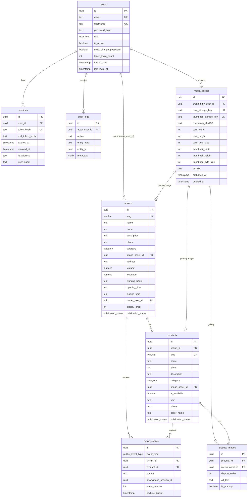
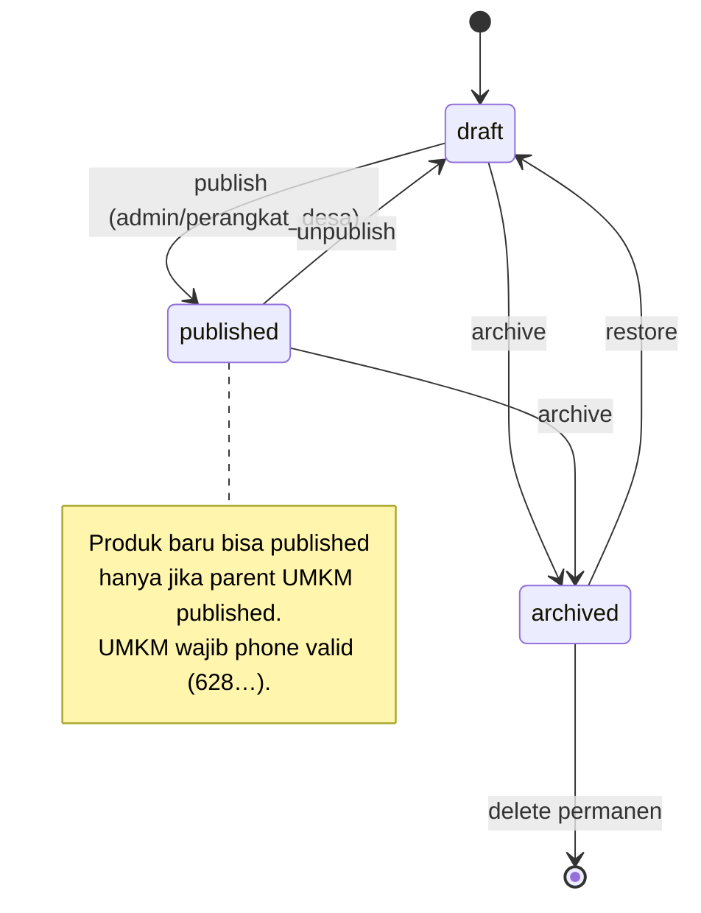

# 04 — Database

## Sumber Kebenaran

- **Definisi tabel:** `backend/src/db/schema.ts` (Drizzle ORM, PostgreSQL).
- **Semua query:** `backend/src/db/repository.ts`.
- **Migrasi:** `backend/drizzle/` (SQL, 0000–0016), runner `backend/src/db/migrate.ts`.

## 🗺️ ER Diagram



## 📋 Tabel & Tanggung Jawab

| Tabel | Fungsi | Catatan penting |
|---|---|---|
| `users` | Akun admin/owner | `username` lowercased + regex `^[a-z0-9._-]{3,30}$`; `failed_login_count >= 0` |
| `sessions` | Session login | hanya hash SHA-256 token yang disimpan; `revoked_at` untuk revoke soft |
| `audit_logs` | Append-only activity log | `metadata` JSONB |
| `media_assets` | Record media (WebP card+thumb) | `checksum_sha256` wajib 64-hex; orphan & delete soft |
| `umkms` | Profil usaha | phone wajib `^628[0-9]{7,12}$`; lokasi pair (lat/lng) harus bersamaan |
| `products` | Produk | `price` boleh `NULL`; wajib punya `imageUrl` ATAU `imageAssetId`; bisa standalone (tanpa `umkm_id` jika punya `phone`) |
| `product_images` | Gallery produk (maks 5) | unique media per produk; maks 1 primary per produk |
| `public_events` | Event analitik publik | dedupe 5 menit per (session, type, target, source) |

## 🎨 Enums

| Enum | Nilai |
|---|---|
| `category` (9) | `Kuliner`, `Sembako & Kebutuhan Harian`, `Fashion & Konveksi`, `Bahan Bangunan & Material`, `Jasa & Otomotif`, `Pertanian, Peternakan & Perikanan`, `Ritel & Perabot`, `Kerajinan & Olahan Kreatif`, `Lainnya` |
| `user_role` (4) | `superadmin`, `admin`, `perangkat_desa`, `pelaku_umkm` |
| `publication_status` (3) | `draft`, `published`, `archived` |
| `public_event_type` (5) | `umkm_view`, `product_view`, `inquiry_started`, `message_copied`, `whatsapp_opened` |

## 🔗 Relasi & Foreign Key

| Dari | Ke | On Delete |
|---|---|---|
| `sessions.user_id` | `users.id` | cascade |
| `audit_logs.actor_user_id` | `users.id` | set null |
| `media_assets.created_by_user_id` | `users.id` | set null |
| `umkms.image_asset_id` | `media_assets.id` | set null |
| `umkms.owner_user_id` | `users.id` | set null |
| `products.umkm_id` | `umkms.id` | cascade |
| `products.image_asset_id` | `media_assets.id` | set null |
| `product_images.product_id` | `products.id` | cascade |
| `product_images.media_asset_id` | `media_assets.id` | restrict |
| `public_events.umkm_id` | `umkms.id` | set null |
| `public_events.product_id` | `products.id` | set null |

## 📐 Constraint Penting (logika bisnis di DB)

- **users**: `username` harus lowercase + valid; `failed_login_count >= 0`.
- **umkms**: `phone ~ '^628[0-9]{7,12}$'`; published WAJIB phone valid; lat/lng harus pair; lat ∈ [-90,90], lng ∈ [-180,180]; `imageUrl` XOR `imageAssetId`.
- **products**: `price >= 0` atau null; wajib punya gambar; `phone` valid bila ada; standalone owner (`umkm_id` ATAU `phone`).
- **product_images**: maks 1 primary (partial unique index `WHERE is_primary = true`); media unik per produk.
- **public_events**: target check (umkm XOR product); `source` whitelist; `event_version = 1`; dedupe index partial.

## 🔄 State Machine Publikasi



## 🧱 Migrasi

- **17 file** di `backend/drizzle/` (`0000` sampai `0016`), dikelola **Drizzle Kit**.
- **Semua idempotent** — aman dijalankan ulang (penting untuk Render deploy).
- Runner (`migrate.ts`) menerapkan migrasi **transaksional** dan mencatatnya di ledger `drizzle.__drizzle_migrations`, plus langkah integritas:
  `preparePublicIntegrity → 0008 → 0009 → 0010…0014 → assertPublicIntegrity → assertBusinessLocationIntegrity`.

Perintah:

```bash
npm --prefix backend run db:generate   # generate migrasi baru dari schema.ts
npm run db:migrate                     # terapkan migrasi (tanpa seed/bootstrap)
```

> [!IMPORTANT]
> Ubah `schema.ts` terlebih dahulu, lalu `db:generate`, **jangan** edit `drizzle/*.sql` secara manual.

## 🌱 Seed

- **Development:** 52 produk + 15 UMKM fiktif, 9 kategori, ID namespace `e3000000-…` (gambar AI-generated, bukan bisnis nyata).
- **Test:** data foundation untuk fixture E2E (namespace `e2000000-…`).
- **Preview:** disabled, sengaja gagal.
- Guard target: `target-safety.ts` menolak target production-like; `ALLOW_SEED=1` + `SEED_DEVELOPMENT_PASSWORD` wajib untuk dev.

## ➡️ Lanjut

Berikutnya: [05 — API Reference](05-api-reference.md).
