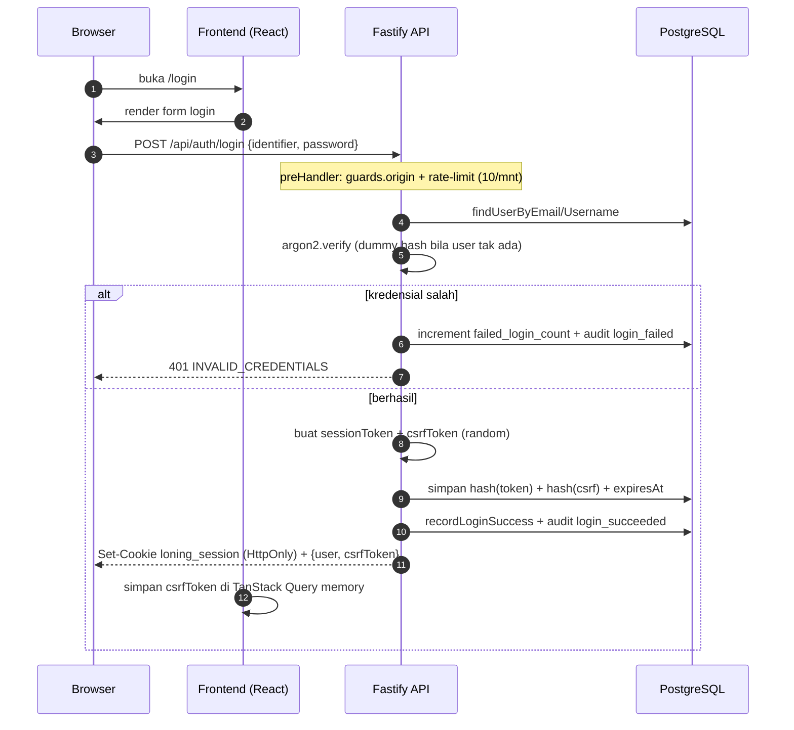
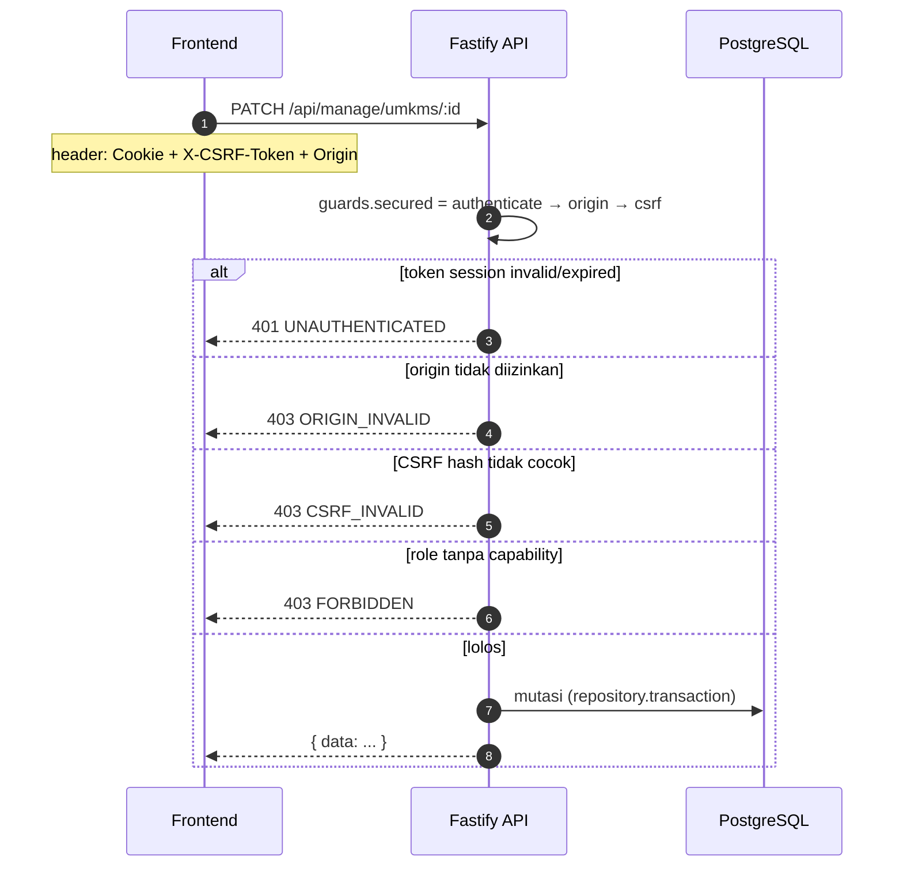
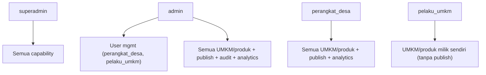

# 06 — Auth & Security

## 🔐 Model Autentikasi

- **Password hashing:** Argon2id (memory 19456 KiB, time 2, parallelism 1) — `backend/src/auth/security.ts`.
- **Session token:** 32 byte random → base64url. Hanya **SHA-256 hash** yang disimpan di DB (`sessions.token_hash`). Token mentah hanya di cookie browser.
- **Cookie:** `loning_session`, `HttpOnly`, `SameSite=Lax` (dev) / `None` (prod), `Secure` di produksi, path `/`, expiry eksplisit (`SESSION_TTL_HOURS`, default 168 jam).
- **CSRF:** token acak kedua; hash disimpan di `sessions.csrf_token_hash`; token mentah dikirim frontend lewat header `X-CSRF-Token`.

## 🔄 Alur Login & Session



## 🔄 Alur Mutasi Aman (CSRF + Origin)



> **Penting:** `guards.secured` = `[authenticate, origin, csrf]`. Guard `requireCapability(cap)` ditambahkan terpisah per endpoint bila perlu.

## 🛡️ Guard Details (`backend/src/auth/guards.ts`)

| Guard | Fungsi |
|---|---|
| `authenticate` | Ambil token dari cookie `loning_session` (fallback `Authorization: Bearer`), hash, cari session valid. Tolak 401 jika tidak ada; 403 jika user nonaktif/role invalid/must-change-password |
| `origin` | Validasi header `Origin` terhadap allowlist (CORS_ORIGIN + regex Vercel + lonjingmaju.my.id) |
| `csrf` | Bandingkan `X-CSRF-Token` (hash) dengan `session.csrfTokenHash` via `timingSafeEqual` |
| `requireCapability(cap)` | 403 jika role tidak punya capability |
| `requireAnyCapability([...])` | 403 jika tak satupun capability cocok |

## 🎭 Role & Capability Matrix

Sumber kebenaran: `backend/src/auth/policy.ts`. Ringkasan:

| Kemampuan | superadmin | admin | perangkat_desa | pelaku_umkm |
|---|---|:---:|:---:|:---:|:---:|
| Kelola user | ✅ semua | ✅ (hanya perangkat_desa & pelaku_umkm) | ❌ | ❌ |
| Lihat SEMUA UMKM/produk | ✅ | ✅ | ✅ | ❌ (own only) |
| Create UMKM/produk | ✅ | ✅ | ✅ | produk own only |
| Publish/unpublish | ✅ | ✅ | ✅ | ❌ |
| Archive/restore/delete | ✅ | ✅ | ✅ | own only (archive/restore) |
| Assign owner / transfer | ✅ | ✅ | ❌ | ❌ |
| Audit log (global) | ✅ | ✅ | ❌ | ❌ |
| Analitik (global) | ✅ | ✅ | ✅ | ❌ |
| Media | ✅ all | ✅ all | ✅ all | own only |

**Aturan khusus:**
- `admin` hanya bisa membuat/kelola user `perangkat_desa` dan `pelaku_umkm` (bukan `superadmin`/`admin` lain).
- User tidak bisa mengubah/delete dirinya sendiri, atau menurunkan role sendiri.
- **Last-active-superadmin** dan **last-active-admin** tidak bisa dihapus/dinonaktifkan (guard `LAST_SUPERADMIN`/`LAST_ADMIN`).

### Diagram RBAC



## 🚦 Rate Limiting & Lockout

| Target | Limit |
|---|---|
| Global API | `RATE_LIMIT_MAX` (default 100/menit) |
| Login | `LOGIN_RATE_LIMIT_MAX` (default 10/menit) |
| Change password | 5/menit |
| Reset password (admin) | 5/menit |
| Events | 30/menit |
| CSV export | 10/menit |

**Account lockout:** `LOGIN_MAX_ATTEMPTS` (default 5) gagal → `LOGIN_LOCKOUT_MINUTES` (default 15) terkunci.

## 🌐 CORS & Origin Allowlist

`app.ts` + `guards.ts` konsisten:
- Allowlist dari `CORS_ORIGIN` (comma-separated).
- Regex tambahan: `https://*.vercel.app`, `https://(www.)loningmaju.my.id`.
- Credentialed (`credentials: true`), header yang diizinkan: `Content-Type`, `X-CSRF-Token`, `Authorization`.
- Request tanpa `Origin` diizinkan (curl/native), karena CSRF tetap dijaga terpisah.

## 🍪 Cookie Cross-Site (iOS Safari ITP fallback)

Karena iOS Safari bisa memblokir cookie cross-site (ITP), frontend menyimpan `loning_session_token` di `localStorage` dan mengirimnya sebagai `Authorization: Bearer` sebagai **fallback**. Backend `authenticate` cek cookie dulu, baru Bearer. (Lihat `frontend/src/lib/api.ts` dan `frontend/src/lib/auth.ts` `rememberSession`.)

## 🔑 Bootstrap Super Admin

`npm run db:bootstrap-admin` membuat **tepat satu** `superadmin` tanpa default password. Wajib set env sementara:

```
BOOTSTRAP_ADMIN_EMAIL, BOOTSTRAP_ADMIN_USERNAME, BOOTSTRAP_ADMIN_PASSWORD,
BOOTSTRAP_ADMIN_DISPLAY_NAME, ALLOW_ADMIN_BOOTSTRAP=1, BOOTSTRAP_CONFIRM=CREATE_SUPERADMIN
```

- Menolak target production-like, menolak bila superadmin sudah ada.
- `admin:create` adalah alias lama yang **sengaja hard-fail**.

## ⚠️ Daftar Keamanan Ringkas

- [x] Argon2id password hashing
- [x] Session token opaque + hash di DB
- [x] CSRF token + Origin check pada mutasi
- [x] Cookie HttpOnly/Secure/SameSite
- [x] Rate limiting + account lockout
- [x] CORS credentialed single-origin
- [x] Audit log append-only
- [x] Slug conflict & identifier safety
- [x] CSV anti formula injection
- [x] Media safe key (no path traversal)
- [x] Password policy (min 8, wajib beda, must-change)

## ➡️ Lanjut

Berikutnya: [07 — Frontend Guide](07-frontend-guide.md).
