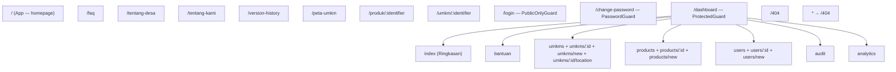
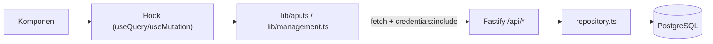

# 07 — Frontend Guide

## 🧱 Tech Stack

React 19 · Vite 6 · TypeScript 5.8 (strict) · Tailwind CSS 4 · TanStack Query 5 · React Router 7 · Motion 12 · Lucide React.

## 🗺️ Route Tree

**Guard hierarchy (dari `main.tsx`):**
1. `PublicOnlyGuard` — redirect ke dashboard bila sudah login (untuk `/login`).
2. `ProtectedGuard` — redirect ke `/login` bila belum login.
3. `PasswordGuard` — redirect ke `/change-password` bila `mustChangePassword`.
4. `CapabilityGuard capabilities=[...]` — per route, cek capability dari session.

## 🧩 Entry Points

| File | Isi |
|---|---|
| `main.tsx` | `createRoot` → `StrictMode` → `QueryClientProvider` → `ToastProvider` → `BrowserRouter` → `LazyRouteBoundary` → `Suspense` → `Routes`. Juga `PublicNavigationManager` (scroll + focus management). |
| `App.tsx` | Homepage publik: komposisi Navbar + section + dialog (WhatsApp, UMKM detail, Product detail). |
| `index.css` | Design tokens Tailwind 4 + global styles. |

## 📡 Data Flow

- **Server state** dikelola TanStack Query (cache key: `['umkms', params]`, `['products', params]`, `['auth','session']`, `['auth','csrf']`, `['manage',…]`, `['admin',…]`).
- **State katalog** (pencarian/kategori) di-encode di URL via `useDiscoveryUrlState` → refresh/back-forward/share link konsisten.
- **Stale time:** produk/UMKM 3 menit; detail publik 5 menit; session 1 menit.

## 🔐 Auth Flow Frontend

1. `useSession()` → `GET /api/auth/session` (401 di-normalize jadi `null`, tidak retry).
2. Login → `useLogin()` → simpan `csrfToken` di TanStack Query memory (bukan localStorage).
3. Mutasi → `useManagedMutation` → `getFreshCsrfToken()` → kirim `X-CSRF-Token`.
4. Jika CSRF invalid → auto-refresh session → retry sekali.
5. Logout → hapus cache `manage`/`admin`, `rememberSession(client, null)`.

**Fallback iOS ITP:** `rememberSession` menyimpan `loning_session_token` di `localStorage`; `api.ts` mengirimnya sebagai `Authorization: Bearer` bila cookie diblokir.

## 🛡️ Guards (Frontend)

| Guard | File | Perilaku |
|---|---|---|
| `PublicOnlyGuard` | `Guards.tsx` | Login page: redirect ke `/dashboard` (atau `/change-password`) bila sudah login |
| `ProtectedGuard` | `Guards.tsx` | Dashboard: redirect `/login` bila belum login (state `from`) |
| `PasswordGuard` | `Guards.tsx` | Redirect `/change-password` bila `mustChangePassword` |
| `CapabilityGuard` | `Guards.tsx` | Redirect `/dashboard` bila role tak punya capability |

## 🧰 Hooks Penting

| Hook | File | Fungsi |
|---|---|---|
| `useSession` / `useCsrfToken` / `useLogin` / `useLogout` | `hooks/useAuth.ts` | Auth state |
| `useProducts` / `useUMKMs` | `hooks/` | Fetch publik (stale 3m) |
| `useManagedList` / `useManagedItem` / `useManagedMutation` | `hooks/useManagement.ts` | Dashboard data + mutasi (auto CSRF + toast) |
| `useDiscoveryUrlState` | `hooks/discovery/` | State katalog di URL |
| `useDebouncedValue` | `hooks/` | Debounce pencarian |
| `useUnsavedChanges` | `hooks/` | Proteksi form belum disimpan |

## 📄 Komponen Utama

| Kategori | Komponen |
|---|---|
| Layout | `Navbar`, `Footer`, `PublicPageShell` |
| Home | `HeroSection`, `CategorySection`, `FeaturedProductsSection`, `FeaturedBusinessesSection`, `MissionSection`, `EditorialTeasers`, `HowItWorksSection`, `FaqSection`, `FinalCtaSection`, `AboutVillageSection` |
| Dashboard | `DashboardShell` (sidebar), `Guards`, `ResourceList`, `Ui` |
| Business | `BusinessCard`, `UMKMImage` |
| Product | `ProductCard`, `ProductImage`, `ProductGallery`, `GalleryManager` |
| Shared | `WhatsAppInquiryDialog`, `UMKMDetailDialog`, `ProductDetailDialog`, `Toast`, `EmptyState`, `LoadingSkeleton`, `PageErrorBoundary`, `ShareButton`, `RelatedProducts`, `PublicDetailState`, `BusinessLocation`, `DeveloperContactDialog` |

## 🔗 SEO (SPA-side)

`lib/seo.ts` → `usePageMetadata()`:
- `document.title`, meta description, OpenGraph, Twitter card, canonical link.
- JSON-LD: `Organization` (default) & `LocalBusiness` (detail UMKM).
- `lib/catalog-url.ts` — state pencarian di query string.
- `lib/siteUrl.ts` — build URL absolut dari `VITE_PUBLIC_SITE_URL`.

**Catatan:** SEO metadata client-side (bukan SSR); initial HTML belum server-rendered.

## 🗺️ Lokasi & Peta

`lib/location.ts`:
- Parse input koordinat dari Google Maps URL (`@lat,lng`, `query`, `ll`) & OSM (`#map=z/lat/lng`, `mlat/mlon`).
- Build embed URL OSM + Google Maps, dan URL search/directions.
- Halaman `/peta-umkm` menampilkan semua UMKM; editor lokasi di `/dashboard/umkms/:id/location`.

## 🎨 Design Tokens (DESIGN.md)

Palet utama: Forest `#1C3F24`, Terracotta `#C85C43`, Charcoal `#1F2421`, Warm Gray `#606662`, Cream `#FAF9F6`, Sage `#DFE4E1`. Font: Inter (body), serif editorial (hero), mono (metadata). Lihat `frontend/src/index.css` untuk variable CSS lengkap.

## ➡️ Lanjut

Berikutnya: [08 — Backend Guide](08-backend-guide.md).
