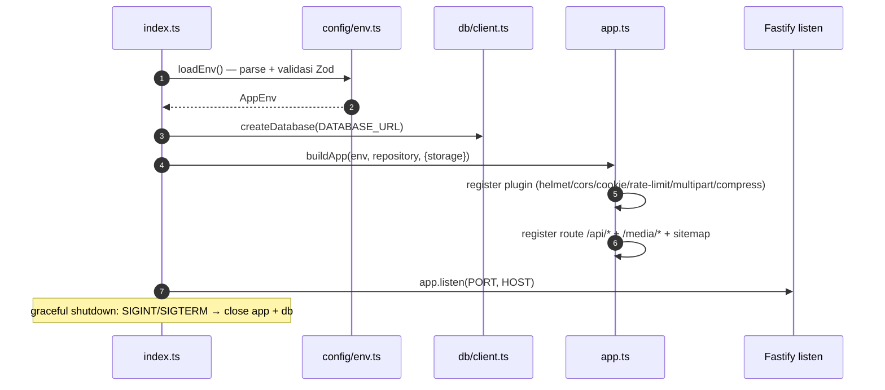

# 08 — Backend Guide

## 🧱 Tech Stack

Fastify 5 · TypeScript ESM · Drizzle ORM 0.45 · Zod 4 · PostgreSQL driver `postgres` · Argon2 · Sharp · AWS SDK S3.

## 🔌 Startup Flow



## 📂 Arsitektur Kode

```
index.ts  →  app.ts (factory)  →  routes/*.ts  →  repository.ts  →  drizzle →  PostgreSQL
                    │
                    ├── auth/ (guards + policy + security)
                    └── media/ (storage + processor)
```

### Pola layering (PENTING)

1. **routes** — parsing/validasi request (Zod), orchestrate guard + repository, format respons `{ data }`.
2. **repository** — satu-satunya tempat query SQL. Fungsi menerima input terfilter, mengembalikan objek terpetakan.
3. **auth/policy** — capability matrix + helper scope (`canViewUMKM`, `canUpdateProduct`, dst).
4. **domain** — pure function (phone, location).

> [!TIP]
> Jangan menulis SQL langsung di routes. Selalu tambahkan fungsi baru di `repository.ts`.

## 🛡️ Cara Menambah Endpoint Baru (panduan)

1. Tentukan family route (public → `umkms.ts`/`products.ts`; dashboard → `manage.ts`/`admin.ts`; media → `media.ts`).
2. Tambah fungsi query di `repository.ts` bila perlu.
3. Definisikan schema Zod input di `validation.ts` (atau inline).
4. Register route dengan preHandler yang sesuai:
   - Public read: tanpa guard.
   - Authenticated read: `[guards.authenticate, guards.requireAnyCapability([...])]`.
   - Mutasi aman: `guards.secured` (+ `requireCapability` bila perlu).
5. Wrap hasil dengan `{ data: … }`, error dengan `error(message, code)` (dari `validation.ts`).

Contoh pola endpoint publik (dari `routes/umkms.ts`):

```ts
app.get('/umkms', async (request, reply) => {
  const parsed = querySchema.safeParse(request.query);
  if (!parsed.success) return reply.code(400).send(error('Invalid query parameters', 'VALIDATION_ERROR'));
  return { data: await repository.listUMKMs({ ...parsed.data, q: parsed.data.q || undefined }) };
});
```

## 🧾 Error Handler (app.ts)

Pemetaan global:
- `SlugConflictError` → status sendiri.
- PG `23505` (unique) → `409 DUPLICATE_ENTRY`.
- PG `23503` (FK) → `400 INVALID_REFERENCE`.
- PG `23514` (check) → `400 VALIDATION_ERROR`.
- Lainnya → `{ error: { message, code } }` (500 → `INTERNAL_ERROR`).

## 📦 Repository — Fungsi Utama

| Kelompok | Fungsi |
|---|---|
| Public | `listUMKMs`, `getUMKM`, `listProducts`, `getProduct`, `listRelatedProducts`, `getSitemapUMKMs`, `getSitemapProducts` |
| Auth | `findUserByEmail`, `findUserByUsername`, `findSession`, `createSession`, `revokeSession`, `recordLoginFailure/Success`, `changePassword` |
| Dashboard stats | `getDashboardStats` |
| Managed UMKM | `listManagedUMKMs`, `getManagedUMKM`, `createUMKM`, `updateUMKM`, `verifyUMKMContact`, `assignUMKMOwner`, `setUMKMPublication`, `deleteUMKM`, `updateUMKMLocation`, `clearUMKMLocation` |
| Managed produk | `listManagedProducts`, `getManagedProduct`, `createProduct`, `updateProduct`, `moveProduct`, `setProductPublication`, `deleteProduct` |
| User/admin | `listUsers`, `createUser`, `updateUser`, `deleteUser`, `listAuditLogs`, `addAudit` |
| Media | `getMediaAsset`, `createMediaAsset`, `updateMediaAltText`, `mediaReferenceCount`, `deleteMediaAsset`, `refreshMediaOrphans` |
| Gallery | `getProductImages`, `addProductImage`, `removeProductImage`, `setProductPrimaryImage`, `reorderProductImages`, `countProductImages` |
| Events/analytics | `insertPublicEvent`, `inquiryAnalytics`, `inquiryAnalyticsByTarget` |

## 🎯 Pola Transaksi & Idempotency

- Mutasi kompleks dibungkus `repository.transaction(async (tx) => { ... })`.
- Create UMKM/produk pakai `allocateSlugWithRetry` (slug unik, retry hingga 10k attempt).
- Idempotency key (header) memakai `idempotencyCache` in-memory (lihat `lib/idempotency.ts`).

## 🌐 Identifikasi Publik (slug vs UUID)

`publicIdentifierPredicate` di `repository.ts`: parameter `:id` bisa berupa **UUID** atau **slug**. Panjang identifier dibatasi 128 char. Slug dihasilkan oleh `lib/slug.ts` (`slugify` + `buildSlugCandidate` untuk suffix `-2`, `-3`, …).

## 🧪 Domain Logic

| Modul | Fungsi |
|---|---|
| `domain/phone.ts` | `normalizeIndonesianWhatsAppNumber`: `08…` → `628…`, validasi `^628[0-9]{7,12}$` (10–15 digit) |
| `domain/location.ts` | `normalizeCoordinates` (round 6 desimal, validasi rentang), `parsePgNumeric` |

## 🛠️ Scripts Backend (via `npm --prefix backend run …`)

| Script | Fungsi |
|---|---|
| `dev` | `tsx watch src/index.ts` |
| `build` / `start` | `tsc` → `node dist/src/index.js` |
| `typecheck` | `tsc --noEmit` |
| `test` | `vitest run` |
| `db:generate` | drizzle-kit generate |
| `db:migrate` | jalankan migrasi |
| `db:seed:dev` / `db:seed:test` / `db:seed:preview` | seed guarded |
| `db:reset-safe` | reset data dev (tanpa hapus volume) |
| `db:bootstrap-admin` | buat superadmin |
| `sessions:cleanup` / `media:cleanup` / `analytics:retention:apply` | maintenance |
| `e2e:setup` | setup fixture E2E |
| `db:audit` / `db:seed-hash` / `storage:check` / `media:audit` / `media:recover-seed` | audit & tools |

## 📏 Environment Validation (config/env.ts)

Zod schema memvalidasi semua variabel dan **menolak konfigurasi produksi tidak aman**:
- `DATABASE_URL` wajib (kecuali `requireDatabase=false`).
- Produksi wajib: `CORS_ORIGIN`, `COOKIE_SECURE=true`, `MEDIA_STORAGE_DRIVER=s3`, `MEDIA_PUBLIC_BASE_URL`, `PUBLIC_SITE_URL` (HTTPS, bukan localhost/example).
- S3: `S3_BUCKET` + `S3_REGION` wajib; access key/secret harus berpasangan.

Lihat daftar lengkap di [`backend/.env.example`](../../backend/.env.example).

## ➡️ Lanjut

Berikutnya: [09 — Media Pipeline](09-media-pipeline.md).
