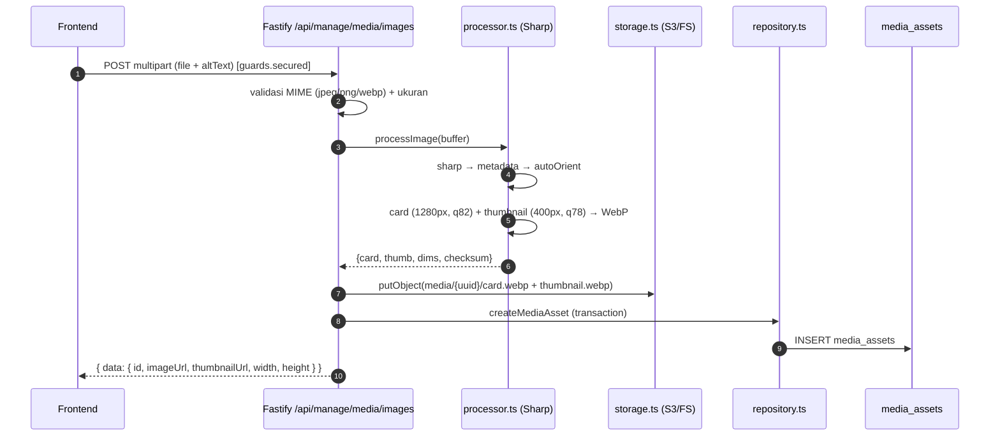

# 09 — Media Pipeline

## 🎯 Tujuan

Upload gambar (JPEG/PNG/WebP) → proses (auto-orient, resize, WebP) → simpan ke storage (S3/FS) → record di `media_assets` → serve via `/media/*`.

## 🔄 Pipeline

## 🖼️ Proses Gambar (`media/processor.ts`)

| Langkah | Detail |
|---|---|
| Validasi ukuran | `MEDIA_MAX_BYTES` (default 5 MB) |
| Tolak SVG/animated | hanya jpeg/png/webp; `pages > 1` ditolak |
| Batas dimensi | `MEDIA_MAX_WIDTH/HEIGHT` (8000), `MEDIA_MAX_PIXELS` (40M) |
| Auto-orient | `sharp().autoOrient()` |
| Card | resize 1280×1280 `fit:inside` (no upscale) → WebP q82 |
| Thumbnail | resize 400×400 → WebP q78 |
| Checksum | SHA-256 dari buffer asli |

## 💾 Storage (`media/storage.ts`)

| Driver | Lokasi | Catatan |
|---|---|---|
| `filesystem` | `MEDIA_FILESYSTEM_ROOT` (default `./storage`) | development only; produksi ditolak |
| `s3` | S3-compatible (R2) | produksi; bucket privat |

**Interface `MediaStorage`:** `putObject`, `deleteObject`, `exists`, `getPublicUrl`, `stream`.

**Aturan object-key aman** (`safeKey`): lowercase, tanpa traversal (`..`), tanpa null byte, tanpa path absolut, panjang ≤ 512, wajib ada extension. Kunci penyimpanan: `media/{uuid}/card.webp` dan `media/{uuid}/thumbnail.webp`.

**URL publik:** `buildPublicMediaUrl` → `{baseUrl}/media/{key}` (namespace `media/` diekspos tepat sekali).

## 🌐 Serving (`routes/media-serve.ts`)

- `GET /media/*` — streaming dari storage di SEMUA environment (tanpa probing filesystem saat startup).
- Cek path aman (tolak `%2f`, `%5c`, `%00`, traversal).
- Kompatibilitas: `/media/{uuid}/…`, `/media/media/{uuid}/…`, dan key legacy tanpa prefix tetap terbaca.
- Header: `Cache-Control: immutable` (WebP), `Access-Control-Allow-Origin`, `X-Content-Type-Options: nosniff`, `Content-Disposition: inline`.

## 🧹 Orphan & Cleanup

- `media_assets.orphaned_at` menandai asset yang tidak direferensikan.
- `refreshMediaOrphans(ids)` dijalankan setelah mutasi yang mengubah referensi gambar.
- `media:cleanup` script membersihkan orphan yang melewati `MEDIA_ORPHAN_GRACE_HOURS` (default 24 jam).
- Delete media hanya diizinkan bila `mediaReferenceCount === 0` (belum direferensikan UMKM/produk/gallery).

## 📋 Batasan

- Maks 1 file per upload.
- Format: JPEG, PNG, WebP (bukan SVG/GIF animated).
- 1 gambar primer per UMKM/produk; gallery produk maks 5 gambar.
- Dimensi & ukuran dibatasi konfigurasi.

## ➡️ Lanjut

Berikutnya: [10 — Deployment](10-deployment.md).
