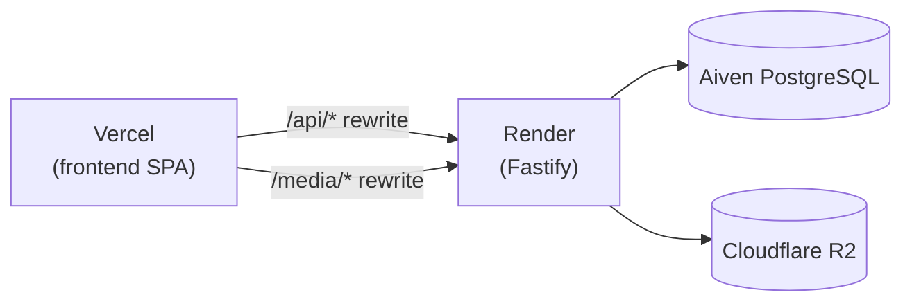

# 10 — Deployment

## 🏗️ Topologi Produksi

| Komponen | Platform | Config |
|---|---|---|
| Frontend (SPA) | **Vercel** | `vercel.json` + `frontend/vercel.json` |
| Backend (Fastify) | **Render** | `render.yaml` |
| Database | **Aiven PostgreSQL** | `DATABASE_URL` (sslmode=require) |
| Media | **Cloudflare R2** (S3) | env S3_* |



## ⚙️ Vercel (`vercel.json`)

```json
{
  "rewrites": [
    { "source": "/api/:path*",   "destination": "https://loningmarketplace.onrender.com/api/:path*" },
    { "source": "/media/:path*", "destination": "https://loningmarketplace.onrender.com/media/:path*" },
    { "source": "/(.*)",         "destination": "/index.html" }
  ]
}
```

- Semua route SPA jatuh ke `index.html` (fallback).
- `/api/*` dan `/media/*` diproxy ke Render.

## ⚙️ Render (`render.yaml`)

- `buildCommand`: `npm ci --include=dev && npm run build:backend`
- `startCommand`: `npm run db:migrate --workspace=backend && npm start --workspace=backend`
- `healthCheckPath`: `/api/health`
- Env vars di-set via dashboard (nilai `sync: false` diisi manual).

> [!IMPORTANT]
> Production startup **hanya** menjalankan migrasi lalu server. **Tidak pernah** seed atau bootstrap.

## 🔐 Environment Variables Wajib (produksi)

| Variable | Keterangan |
|---|---|
| `DATABASE_URL` | Aiven PostgreSQL URL (`sslmode=require`) |
| `CORS_ORIGIN` | Satu exact origin frontend (comma-separated) |
| `COOKIE_SECURE` | `true` |
| `TRUST_PROXY` | `true` (di belakang proxy) |
| `MEDIA_STORAGE_DRIVER` | `s3` |
| `S3_BUCKET` / `S3_REGION` / `S3_ENDPOINT` | R2 config |
| `S3_ACCESS_KEY_ID` / `S3_SECRET_ACCESS_KEY` | R2 credentials |
| `MEDIA_PUBLIC_BASE_URL` | Base URL media publik |
| `PUBLIC_SITE_URL` | Origin publik (HTTPS, tanpa path) |

> Frontend build juga butuh `VITE_PUBLIC_SITE_URL` untuk SEO canonical.

## ✅ Checklist Deploy Frontend

1. `npm run build:frontend` (set `VITE_PUBLIC_SITE_URL`).
2. Deploy `frontend/dist/` sebagai static SPA.
3. Konfigurasi fallback `index.html` untuk semua route.
4. `VITE_API_URL` → URL API produksi (akhiran `/api`, atau `/api` untuk same-domain Vercel).

## ✅ Checklist Deploy Backend

1. `npm run build:backend`.
2. Start: `npm start --workspace=backend`.
3. Health check `/api/health` → 200.
4. Schedule maintenance: `sessions:cleanup`, `media:cleanup`, `analytics:retention:apply`.

## 🔧 Troubleshooting Cepat

| Gejala | Solusi |
|---|---|
| CORS / login cookie error | Samakan `CORS_ORIGIN`, `VITE_API_URL`, `COOKIE_SECURE`, protocol, origin browser |
| "DATABASE_URL is required" | Buat `backend/.env` dari contoh; backend sengaja berhenti tanpa URL |
| Aiven SSL error | Pakai URL lengkap `sslmode=require` |
| DB tidak ready | `npm run db:local:logs` / `db:local:wait`; `/api/ready` 503 sampai siap |
| Forced password change | Akun baru/direset wajib `/change-password` dulu |

## ➡️ Lanjut

Berikutnya: [11 — Testing](11-testing.md).
