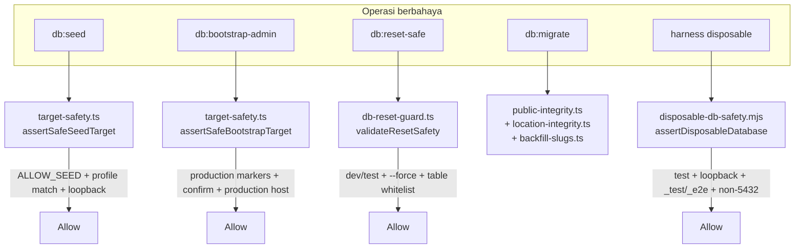

# 13 — Safety & Data Protection

> [!IMPORTANT]
> Loning Maju punya **lapisan keamanan data yang sangat ketat** — jauh di atas rata-rata proyek biasa. Memahami guard-guard ini WAJIB sebelum menyentuh seed, migration, reset, atau deployment, karena salah satu desain intinya adalah **"menolak operasi berbahaya secara default"** (fail-closed).

## 🎯 Filosofi

Semua operasi yang berpotensi merusak data (`seed`, `bootstrap`, `reset`, `migrate`, harness disposable) harus **membuktikan identitas target-nya aman** sebelum diizinkan. Guard menolak dengan pesan `SCOPE_REFUSED: alasan` (contoh: `SEED_TARGET_REFUSED`).

## 🗺️ Peta Guard

## 1️⃣ Seed Target Guard (`db/target-safety.ts`)

`assertSafeSeedTarget(profile, env)` menolak seed kecuali **semua** terpenuhi:

| Cek | Development | Test |
|---|---|---|
| `ALLOW_SEED` | `= 1` | `= 1` |
| `APP_ENV` + `DATABASE_ENVIRONMENT` | `= development` | `= test` |
| `NODE_ENV` | `= development` | `= test` |
| Host | loopback (`localhost`/`127.0.0.1`/`::1`) | loopback |
| Database name | berakhiran `_dev`/`_development` | berakhiran `_test`/`_e2e` |
| Port | — | bukan `5432`, range 1024–65535 |
| Disposable marker | — | `ALLOW_DISPOSABLE_DB_MUTATION=1` + `DISPOSABLE_COMPOSE_PROJECT` cocok regex |

**Deteksi "production-like":** host `aivencloud`/`.render.com`/`loningmarketplace`, nama DB mengandung `prod|production|live`, atau env marker `production`.

`resolveSeedProfile` mewajibkan flag `--profile development|test|preview`; **preview disabled** dan `db:seed` (tanpa profile) hard-fail.

## 2️⃣ Bootstrap Guard (`db/target-safety.ts`)

`assertSafeBootstrapTarget` adalah **kebalikan** dari seed: bootstrap hanya boleh ke **production yang dinyatakan eksplisit**:
- `NODE_ENV` + `APP_ENV` + `DATABASE_ENVIRONMENT` = `production`.
- `ALLOW_ADMIN_BOOTSTRAP=1` + `BOOTSTRAP_CONFIRM=CREATE_SUPERADMIN`.
- Target harus terlihat production (host `aivencloud`/`render.com`, atau nama DB `prod|production|live`).
- Menolak bila superadmin sudah ada; `admin:create` legacy hard-fail.

## 3️⃣ Reset Guard (`scripts/db-reset-guard.ts`)

`validateResetSafety` (dipakai `db-reset.ts`, alias `db:local:reset-safe`):
- `NODE_ENV` ∈ `{development, test}`.
- WAJIB flag `--force`.
- Tabel yang boleh di-TRUNCATE dibatasi whitelist: `products, umkms, media_assets, sessions, audit_logs, users`.
- Compose project harus `marketplace-loning-local` + file `compose.yaml`.
- Menolak identity `prod|production|stag|staging` di host/database.
- `db:local:reset` (docker volume) lebih destruktif — di `package.json`, bukan guard ini.

## 4️⃣ Disposable DB Guard (`scripts/lib/disposable-db-safety.mjs`)

Dipakai harness isolated (`run-isolated.mjs`, `verify-seed-determinism.mjs`) dan `analytics:retention:apply`:
- `NODE_ENV=test` + `ALLOW_DISPOSABLE_DB_MUTATION=1`.
- Compose project cocok `marketplace-loning-(test|e2e)-…`.
- Host loopback, port 1024–65535 tapi **bukan 5432** (menghindari development DB).
- Database berakhiran `_test`/`_e2e`, bukan reserved (`loning_digital`, `postgres`, `template0/1`), bukan production-like.
- Wajib username + password eksplisit; `sslmode` harus `disable` (menolak managed/SSL URL).

## 5️⃣ Repository Safety (`scripts/repository-safety.mjs`)

- **`secrets`** — scan file tracked untuk: private key (`-----BEGIN … PRIVATE KEY`), OpenAI key (`sk-…`), AWS key (`AKIA`/`ASIA…`), dan assignment sensitif (`*PASSWORD|SECRET|TOKEN|API_KEY|PRIVATE_KEY|DATABASE_URL=`). Allowlist `isSafeExample` mengecualikan placeholder/`*.test`/localhost.
- **`hygiene`** — tolak path tracked terlarang: `.env` (kecuali `.env.example`), `node_modules`, `dist`, `build`, `coverage`, `test-results`, `playwright-report`, `.phase0-runtime`, dump/backup/sql.gz.

## 6️⃣ Integrity Assertions (dijalankan saat migrate)

`db/migrate.ts` menjalankan rantai integritas setelah migrasi (gagal → deploy dibatalkan):

| Modul | Yang dicek |
|---|---|
| `backfill-slugs.ts` | Preflight: duplicate slug produk/UMKM, nomor WA invalid → tolak; backfill slug null/empty (alokasi deterministik) |
| `public-integrity.ts` | Null/empty/duplicate/oversize slug, kolom slug NOT NULL (96), unique index, phone constraint, published-phone-ready |
| `location-integrity.ts` | Partial coordinate pair, rentang lat/lng, kolom `numeric(9,6)` nullable, definisi constraint |

> Ini menjamin migrasi **tidak pernah** setengah jalan: kalau data tidak memenuhi integritas, migrasi gagal dan tidak tercatat di ledger.

## 🛡️ Ringkasan Aturan Emas Keamanan Data

1. **Seed hanya ke DB development/test loopback** dengan marker eksplisit — bukan production.
2. **Bootstrap hanya ke production eksplisit** dengan konfirmasi.
3. **Reset hanya dev/test** + `--force` + whitelist tabel.
4. **Harness disposable hanya DB `_test`/`_e2e` loopback** non-5432.
5. **Migrasi divalidasi** oleh assertion integritas sebelum commit.
6. **Repository scan** menolak secret & artifact di git.

## ➡️ Lanjut

Berikutnya: [14 — Migrations & Seed](14-migrations-and-seed.md).
