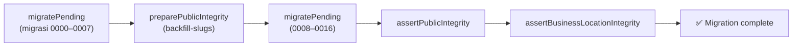

# 14 — Migrations & Seed

## 🧱 Sistem Migrasi

- **17 migrasi** di `backend/drizzle/` (`0000` → `0016`), dikelola Drizzle Kit (`drizzle.config.ts`).
- **Idempotent** — aman dijalankan berulang (penting untuk Render deploy yang menjalankan `db:migrate` di setiap start).
- Runner: `backend/src/db/migrate.ts`.

### Pipeline Migrasi

Tag penting (dari `migrate.ts`):
- `0008_finalize_public_integrity` — preparation.
- `0009_repair_public_integrity` — repair.
- `0016_add_opening_closing_time` — final.

### Ledger & Idempotency

`migrate.ts` menulis ledger ke tabel `drizzle.__drizzle_migrations` (hash + created_at). Setiap migrasi **diterapkan transaksional** dan dicatat hanya setelah SQL-nya sukses. Ini mencegah "rewound" migrasi terlewat (bug klasik Drizzle resume).

### Preflight & Backfill (`backfill-slugs.ts`)

Sebelum menerapkan integritas, `preparePublicIntegrity` menjalankan:
1. **Preflight assertion** — tolak bila ada duplicate slug (produk/UMKM) atau nomor WA invalid (dengan daftar ID pelaku).
2. **Backfill** — isi slug `NULL`/empty dengan `slugify(name)` + alokasi deterministik (`-2`, `-3` untuk collision). Slug canonical yang sudah ada **dipertahankan**.

## 🎯 Migrations Timeline (gambaran)

| Nomor | Isi |
|---|---|
| `0000`–`0004` | Skema dasar + auth (identifier roles) |
| `0005`–`0007` | Trusted inquiry, direct route event sources, public slugs |
| `0008`–`0009` | Finalize + repair public integrity |
| `0010` | UMKM business location |
| `0011` | Optional UMKM image |
| `0012` | Standalone products |
| `0013` | Product images (gallery) |
| `0014` | Relax public events target check |
| `0015` | Expand categories (9 kategori) |
| `0016` | Opening/closing time |

## 🌱 Seed System

### Profile & Target

| Profile | Dipakai | Syarat target |
|---|---|---|
| `development` | `db:seed:dev` | loopback + `_dev`/`_development` + `ALLOW_SEED=1` + `SEED_DEVELOPMENT_PASSWORD` |
| `test` | harness disposable | loopback disposable + `ALLOW_SEED=1` |
| `preview` | disabled | selalu gagal |

### Data

- **Development:** 52 produk + 15 UMKM fiktif, 9 kategori (gambar AI-generated, bukan bisnis nyata).
- **Test:** foundation data untuk fixture E2E.

### ID Deterministik (namespace UUID)

| Namespace | Entitas |
|---|---|
| `e1000000-…` | Users |
| `e2000000-…` | UMKMs (suffix per kategori: 0001 kuliner, 0101 kerajinan, 0201 jasa, dst) |
| `e3000000-…` | Products (suffix = index 12-digit) |
| `e4000000-…` | Media assets |
| `f2000000-…` / `f3000000-…` | Fixture migrasi (test) |

Lihat `backend/src/db/seeds/shared/ids.ts`.

### Seed Determinism

`verify-seed-determinism.mjs` membuktikan:
- **Clean repeatability** — seed DB fresh dua kali → hash SHA-256 + row counts identik.
- **Same-target idempotency** — seed dua kali di DB sama → identik.

Evidence diambil via `db:seed-hash` (hash SHA-256 konten kanonikal + row counts).

## 🧪 Migration Test (existing-data)

`scripts/run-isolated.mjs migration` menguji skenario migrasi data existing:
- null/empty slug → backfill.
- Unicode + collision → fallback `-2`.
- Failure injection (duplicate slug, invalid phone) → migrasi ditolak, data tidak berubah.
- Idempotent rerun → hasil identik.

## ➡️ Lanjut

Berikutnya: [15 — Audit, Events & Analytics](15-audit-events-and-analytics.md).
