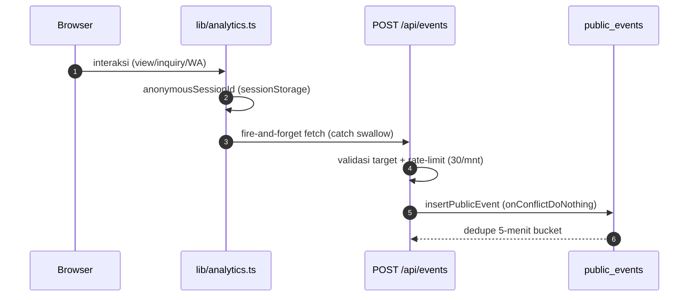

# 15 — Audit, Events & Analytics

## 📋 Audit Log (append-only)

- Tabel `audit_logs` mencatat semua aktivitas privileged. Append-only (tidak ada update/delete lewat API).
- Kolom: `action`, `entity_type`, `entity_id`, `metadata` (JSONB), `ip_address`, `user_agent`, `actor_user_id`.
- Ditulis via `repository.addAudit()` di dalam transaksi yang sama dengan mutasi utamanya.

### Kategori Action (dari `frontend/src/lib/auditEvents.ts`)

| Kategori | Contoh action |
|---|---|
| `auth` | `login_succeeded`, `login_failed`, `login_denied_invalid_role`, `logout`, `password_changed`, `password_reset`, `superadmin_bootstrapped` |
| `umkm` | `created`, `updated`, `contact_verified`, `location_updated`, `location_cleared`, `published`, `unpublished`, `archived`, `restored`, `deleted` |
| `product` | `created`, `updated`, `published`, `unpublished`, `archived`, `restored`, `deleted`, `image_added`, `image_removed`, `image_primary`, `images_reordered` |
| `user` | `created`, `updated`, `password_reset`, `sessions_revoked`, `deleted` |
| `media` | `uploaded`, `updated`, `deleted`, `cleaned_up` |

### Sanitasi Metadata

`sanitizeMetadata()` (frontend) menyaring field sensitif sebelum ditampilkan: `password`, `token`, `secret`, `csrf`, `cookie`, `authorization`, `apikey`, `privatekey`, `databaseurl`, `connectionstring`, dst (recursive ke objek nested).

> Backend juga hanya menyimpan metadata aman — tidak pernah menyimpan password/token mentah di `metadata`.

## 📊 Public Events (Analitik Inquiry)

### Alur (non-blocking)



### Event Types (5)

| Type | Makna |
|---|---|
| `umkm_view` | UMKM dilihat |
| `product_view` | Produk dilihat |
| `inquiry_started` | Dialog inquiry dibuka |
| `message_copied` | Pesan disalin |
| `whatsapp_opened` | WhatsApp dibuka |

### Sources (7)

`homepage_featured`, `homepage_catalog`, `umkm_detail`, `product_detail`, `product_page`, `umkm_page`, `search_results`.

### Deduplication

Unique index parsial per (anonymous_session_id, event_type, target, source, dedupe_bucket 5-menit). `insertPublicEvent` memakai `onConflictDoNothing` — event duplikat dalam 5 menit diabaikan.

### Target Validation (`routes/events.ts`)

- `umkm_view` wajib `umkmId` (tanpa `productId`).
- `product_view` wajib `productId`.
- Target harus ada & public; `productId` + `umkmId` yang tidak cocok → `TARGET_MISMATCH`.
- `event_version` selalu `1`.

## 📈 Inquiry Analytics API

`GET /api/admin/inquiry-analytics?from=YYYY-MM-DD&to=YYYY-MM-DD` (capability `analytics:view-global`):
- Rentang maks 366 hari, UTC, `to >= from`.
- Return: `totals` (per event type), `inquiryStartRate`, `whatsappOpenRate`, `breakdown` (per target).

```json
{
  "data": {
    "from": "...", "to": "...",
    "totals": { "umkm_view": 120, "product_view": 340, "inquiry_started": 45, "message_copied": 12, "whatsapp_opened": 30 },
    "inquiryStartRate": 0.097,
    "whatsappOpenRate": 0.66,
    "breakdown": [ { "umkmId": "...", "umkmName": "...", "productId": null, "productName": null, "eventType": "product_view", "count": 55 } ]
  }
}
```

### Retention

`analytics:retention:apply` menghapus event lebih tua dari **400 hari** (batch 1000). Wajib guard disposable DB. `--apply` untuk eksekusi nyata (tanpa flag = dry-run JSON).

## 🔧 Frontend Tracking (`lib/analytics.ts`)

- `trackPublicEvent(event)` — POST fire-and-forget ke `/events`, swallow error (analitik tidak boleh memblokir CTA).
- `anonymousSessionId()` — UUID di `sessionStorage` (`loning_anonymous_session_id`).
- Dipanggil dari `App.tsx` (product_view), `WhatsAppInquiryDialog.tsx` (inquiry_started, message_copied, whatsapp_opened).

## ➡️ Lanjut

Berikutnya: [16 — Testing Infrastructure](16-testing-infrastructure.md).
